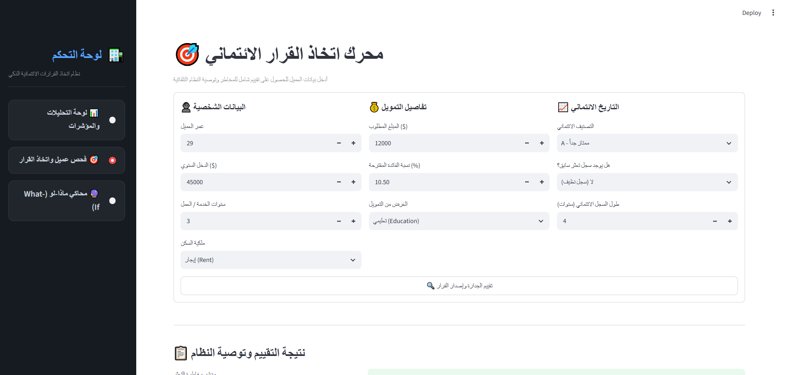

# نظام التنبؤ بالمخاطر الائتمانية (Credit Risk Predictor)

تطبيق ويب تفاعلي يعمل كنظام لدعم القرار (Decision Support System) لمساعدة البنوك والمؤسسات المالية في تقييم طلبات القروض. تم بناء النظام باستخدام خوارزمية (Random Forest Classifier) لتحليل البيانات المالية والتاريخية للعملاء، ويتنبأ باحتمالية التخلف عن السداد بدقة تصل إلى 93.7%. تم تطوير الواجهة باستخدام Streamlit لتوفير تجربة مستخدم سلسة وسريعة.

---

**Credit Risk Predictor (DSS):** An interactive web application built with Python and Streamlit, serving as a Decision Support System for financial institutions. It leverages a Machine Learning model (Random Forest Classifier via Scikit-learn) trained on financial data to evaluate loan applications and predict default risk with a 93.7% accuracy rate.

---

## 📸 واجهة النظام (System Interface)

